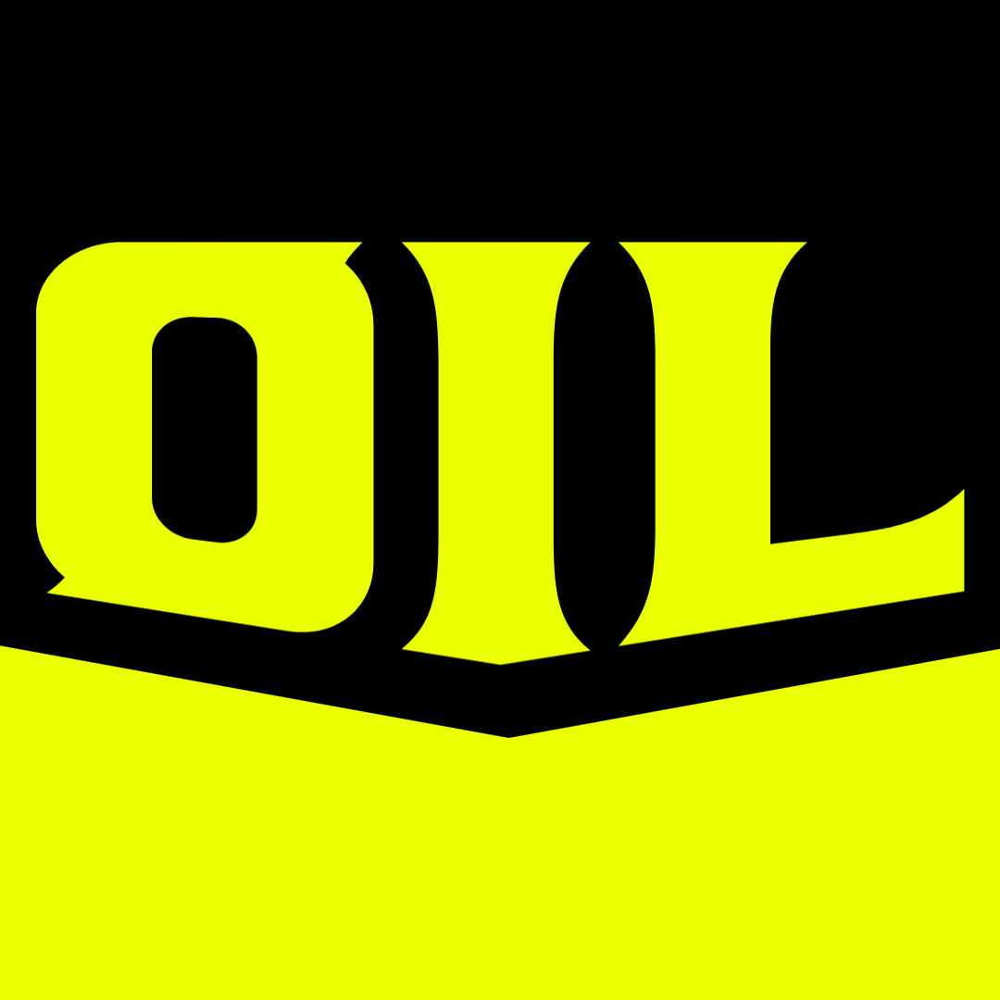

[](https://github.com/Ralph-scott/OIL/ "Logo.")
# OIL: Obvious Imperative Language

OIL is a statically, strongly typed, No-BS imperative programming language that we designed
because we were bored, and though it was a cool idea.</br>
Despite having features that are jokes, this is actually not a joke language.

## Language Philosophy

A lot of languages these days have a high emphasis on abstraction,<br/>
which while maybe making your code safer, also gi

## Ideal Features (Syntax subject to change)

### New reference and dereference operators
```rust
a: int = 0;
#a; // reference to a
@a; // dereference a
```

### Pipe operator
```rust
import std.io.File;

fn (x: int) -> add(y: int): int = x + y;

File.stdout
    -> File.writeln (2 -> add(2) -> add(3) -> add(4));
```

## Ideal Syntax (subject to change)
```rust
import std.io.File;
import std.data.Stack;
import std.iterator.Range;

fn main() = {
    stack: Stack(uint) = Stack.new();

    for i in Range.new(0, 10) {
        #stack -> Stack.push i;
    };

    for i in stack {
        File.stdout
            -> File.write "stack["
            -> File.write i
            -> File.write "] = "
            -> File.writeln stack[i]
    };

    #stack -> Stack.delete();

    std.segfault(); // exit the program safely.
};
```

## End Goal

Our end goal for this project is to have basic .WAV file synthesis.
